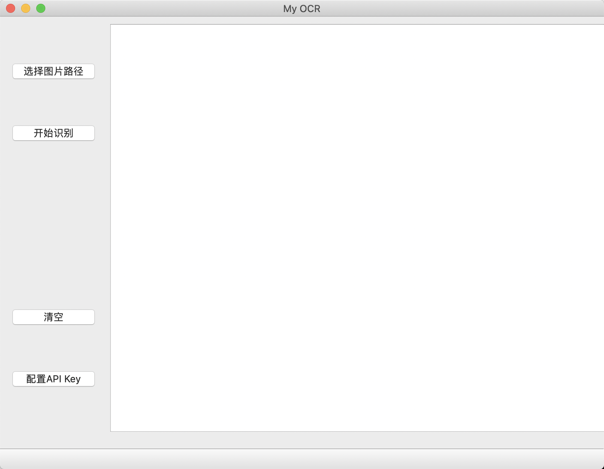

# OCR--PyQt5
基于PyQt5开发的OCR文字识别系统，调用了百度AI平台的API。


## 环境

- Python 3.6+
- PyQt5 5.14
- baidu-aip 2.2+
- tqdm

## 运行

- 配置API

    该项目自带了一个测试用的 API 实例，可将 app.py 中的实例更换为自己的API

    ```python
class MainWindow(QMainWindow, Ui_MainWindow):
    def __init__(self, parent=None):
        super(MainWindow, self).__init__(parent=parent)
        self.setupUi(self)
        self.text = ""
        self.strTime = ""
        self.basicid = ""
        self.filePath = ""

        self.APP_ID = 'yourId'   #APP_ID
        self.API_KEY = 'yourKey'  #API_KEY
        self.SECRET_KEY =  'yoursecret'  #SECRET_KEY
        self.aipOcr = AipOcr(self.APP_ID, self.API_KEY, self.SECRET_KEY)
        ....
    ```

- 运行

`python app.py`





## 应用程序

- 该项目可以使用`pyinstaller` 进行打包，我没有windows电脑，这一步就省略了，打包流程不会很复杂

## 使用方法

- 点击 “选择图片” 选择需要识别的图片；
- 点击 “开始识别” 开始文字识别，结果将出现在右侧的文本框中；
- 点击 “清空”，将清除已选择的图片和文本框中的内容；
- 点击 “配置API Key”，更新你的百度API的key；

